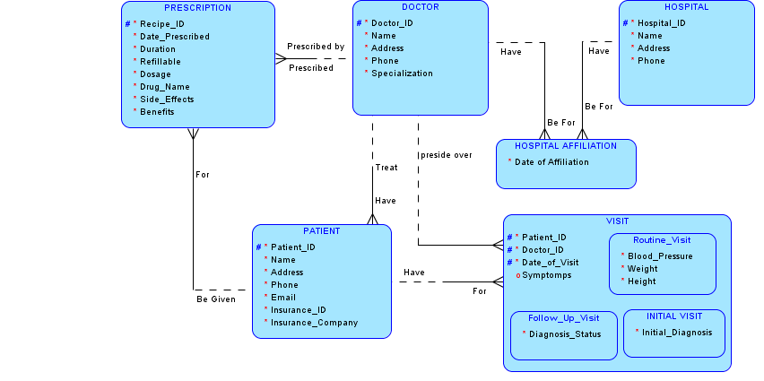

# Oracle Data Modeling - HealthOne Medical Database

# 📌 Entity Relationship Diagram (ERD) - Healthcare System
Proyek ini berisi desain **Entity Relationship Diagram (ERD)** untuk sistem manajemen kesehatan, termasuk dokter, pasien, rumah sakit, dan resep obat.

## 📊 Deskripsi Proyek
ERD ini dirancang untuk merepresentasikan hubungan antara entitas utama dalam sistem layanan kesehatan, yang mencakup:
- **HOSPITAL**: Menyimpan informasi tentang rumah sakit.
- **DOCTOR**: Menyimpan data dokter yang berpraktik.
- **PATIENT**: Menyimpan informasi pasien.
- **PRESCRIPTION**: Menyimpan informasi resep obat yang diberikan dokter kepada pasien.

## 📸 Entity Relationship Diagram
Berikut adalah ERD yang menggambarkan hubungan antara entitas dalam sistem:

## 🚀 Penggunaan
ERD ini dapat digunakan sebagai referensi untuk implementasi database di sistem manajemen kesehatan berbasis SQL atau teknologi lainnya.

## 📬 Kontak
Jika ada pertanyaan atau saran, silakan hubungi saya di [LinkedIn](https://www.linkedin.com/in/izmah-ashfayel-hikmah).

